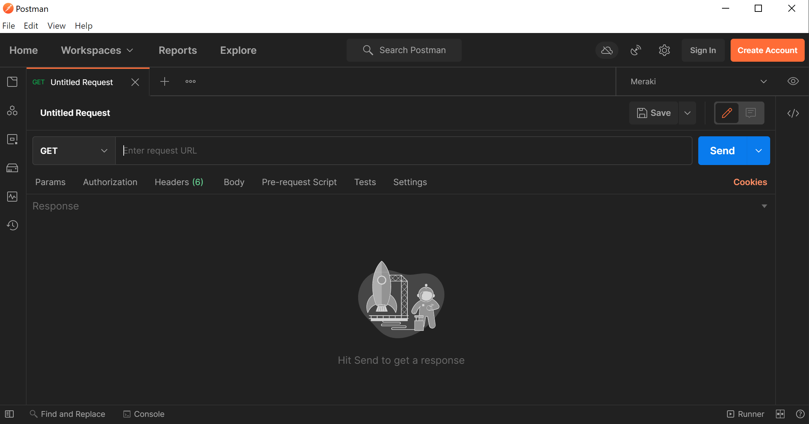
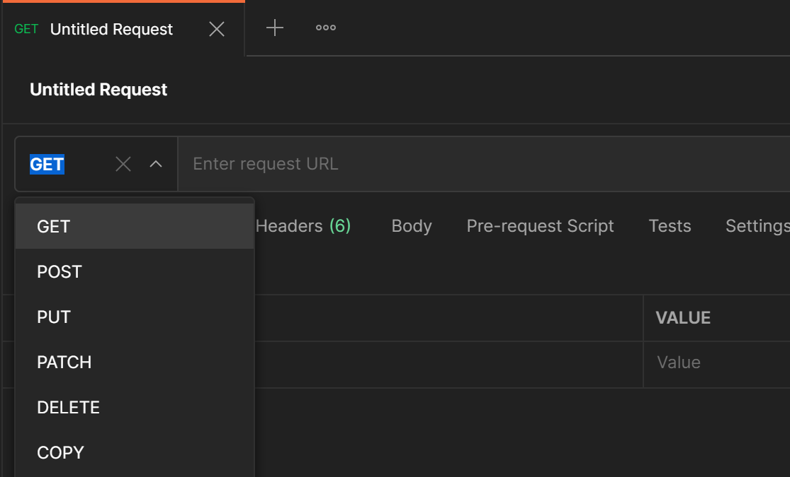
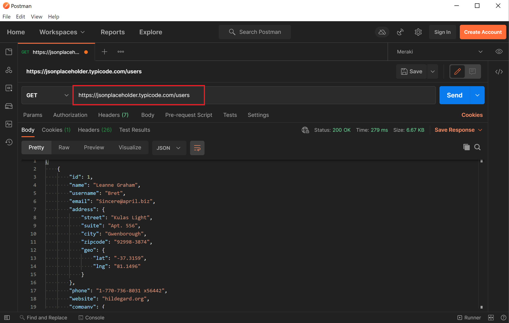
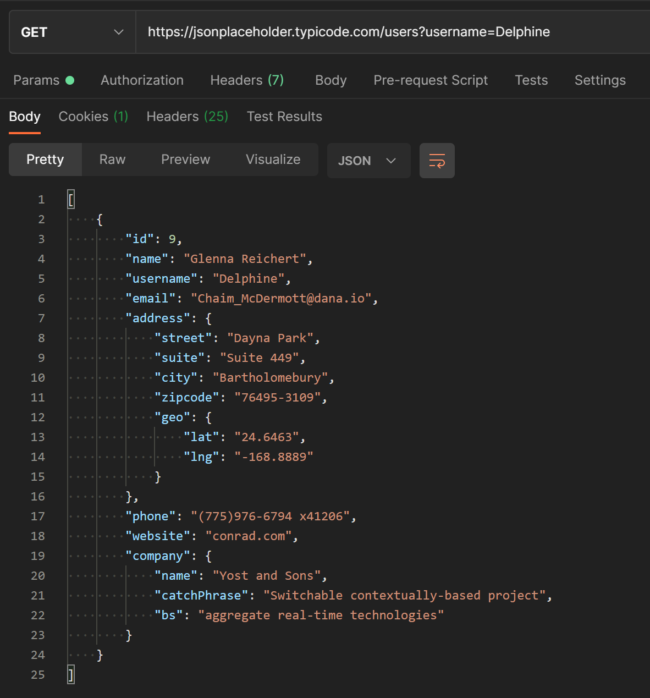

¿Qué es Postman?
================

Es un espacio de trabajo de prueba de APIs, está diseñado para proporcionar un entorno colaborativo para que los desarrolladores y evaluadores prueben exhaustivamente las API antes de lanzarlas a producción.

Este espacio de trabajo está equipado con diferentes colecciones que pueden ayudarle a realizar diversas pruebas para sus APIs.

Si aún no tienes postman instalado descargatelo desde aqui:

* `Download Postman <https://www.postman.com/downloads/>`_

Ejemplo solicitud Get Simple
~~~~~~~~~~~~~~~~~~~~~~~~~~~~

Al iniciar Postman se abrirá un espacio de trabajo en blanco:

Debemos prestar atención al tipo de solicitud HTTP que estamos enviando, y a la URL a la que queremos enviar nuestra solicitud. 

Si pinchamos en el menú desplegable de tipos de solicitud, veremos algunas opciones, en nuestro caso vamos a usar la solicitud GET:

Para crear nuestra primera solicitud, solo necesitaremos ingresar la URL de nuestro endpoint API. 
Usaremos el endpoint de usuario ofrecido por JSON Placeholder, que se encuentra en: https://jsonplaceholder.typicode.com/users

En la captura de pantalla anterior, verá en el cuadro resaltado que ingresamos nuestra URL. 
A continuación, simplemente hacemos clic en el botón grande "**Enviar**" en el lado derecho.

Enviamos la solicitud GET, por lo que en la captura de pantalla también notarás que tenemos nuestra respuesta JSON de la API. 
Los datos simulados que ofrece esta API nos proporcionan una lista de 10 usuarios diferentes, junto con los datos que se han ingresado para cada usuario.

¿Qué pasaría si solo quisiéramos obtener datos de un usuario específico? Bueno, nuestro sitio API de prueba admite el uso de parámetros de consulta para filtrar nuestra respuesta. Digamos que queremos buscar información para un usuario llamado Delphine . 
Agregaríamos ?username=Delphine a nuestra URL:

Como podemos ver arriba, ahora nuestra respuesta JSON solo contiene los datos de un único usuario. 
Si necesitáramos encontrar el número de teléfono de un usuario, esta podría ser una manera fácil de filtrar rápidamente nuestros datos y llegar a lo que necesitamos.

Aquí es realmente donde Postman es genial. 

Resumiendo: 
Podemos probar rápida y visualmente una llamada API. 
Podemos ver cómo se ven los datos de respuesta y comprender la estructura de las solicitudes y respuestas.

Resources
---------

* `Postman <https://www.postman.com/>`_
